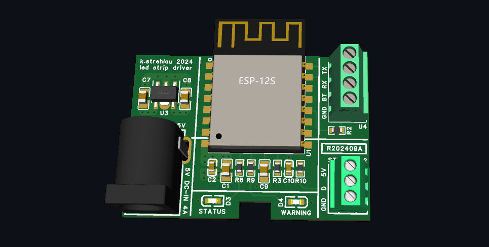

# led-strip-driver
LED strip driver designed to light up my desk

## Brief
In the past, without experience on printed circuit boards (PCBs) design, I developed a WiFi-enabled LED strip controller utilizing the ESP8266. Although it functioned, grounding issues caused interference with other devices. 

Currently, I aim to revitalize this project to illuminate my desk. To prevent interference, I have opted for a four-layer PCB, which is quite affordable these days. While a two-layer design is feasible, I see no reason not to utilize a four-layer configuration if the cost remains the same.

# Hardware
The hardware design is meant to be as simple as possible:

- 4-layer stackup with aim to eliminate unwanted emissions
- 3.3V low quiescent current LDO that powers the MCU
- no additional ESD protection (only built-in)

# Software
The software is C++ based and powered by ksIotFrameworkLib and is going to:
- support HomeAssistent over MQTT protocol
- have multiple operational modes (breathing, snake, rainbow etc)
- have an ability to switch to direct control (UDP based) mentioned earlier
